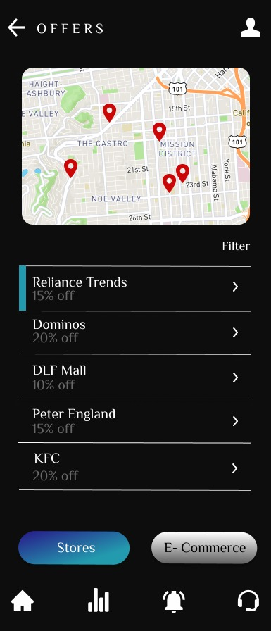

# Open-Banking-Application

 <a href="https://youtu.be/5wrcifu4faA">Project link</a>  Execution video  

 Project documentation is uploaded along with apk file in the above repository.

## PROJECT THEME : FIN-TECH

## PROBLEM STATEMENT
 
As we all know, open banking refers to open APIs that facilitate third-party developers to develop applications and services around the financial institution. This new-built technology is expanding at an exponential rate in the financial market. Nowadays, customers are switching to online banking since offline processes tend to become hectic and time-consuming. But one of the notable issues that bother people and financial firms is the security of data while retaining customer transparency. This issue affects the advancement of digitizing financial services.
Further, some of the prevalent open banking software we know are limited to money transactions and bill payments. So, clients use separate applications for different targets, which makes their online banking experience troublesome. Also, the customers barely find any applicable rewards or offers provided by their respective banks or service providers. So, open banking systems should constantly monitor customer insights, which can be rewarding for both client and service providers.
Overall, this problem statement asks us to find a way to ensure: Faster innovation in the field of open banking, personalized offers for clients and detailed monitoring of customer insights.

  

## SOLUTION’S IMPLEMENTED   
### Making every financial dealing completely online and user-friendly:

Conventional method used to be hectic and time consuming. Also, it was quite difficult for the user to gather all information related to various financial deals. Though online methods make it faster and smoother, the user needs to be self-reliant which can make them a bit hesitant before taking any financial decisions.
So, through our services the client can enjoy:
1.	Varieties of deals over a single platform like opening accounts, money transactions, loans, consultancy, insurance services, investments etc. which makes it very convenient for them.
2.	 In case of any doubts, they can go through the video graphics or  can seek expert's advice.

  

### Constant tracking of customer actions:
In conventional method it was quite difficult for clients to keep a proper track of profit margin and expenditures.
So, we are providing customers:
•	With insights on their transactions and graphs to show their daily, weekly or monthly expenses so as to provide them an organized information and help them to to put a check on their expenses.
•	Data on the profits they had made in their past transactions. 
•	Insights on the profits they can make by doing certain investments.
 

### Experts' advice before any deal and live customer support:
Clients can get spoilt for choices after going through so many investment and loan options, insurance policies etc. So, through our app we will:
•	Highlight the key points i.e., profits, interest rate etc. about every deals so that they can compare and choose the preferrable one.
•	Help them interact with financial experts with 24x7 customer support before making any important financial decisions. This will help the customers to draw optimal conclusions.
•	Constantly update them about the stats of their financial deals.

 

### Personalized offers based on location and interests:
We will notify our customers about the discounts and offers available on their respective financial providers by:
•	Adding location markers on those specific stores. 
•	Sending notifications to the customer regarding the offers applicable on various e-commerce stores.
By including this feature, we are increasing engagement of the financial firms and adding extra benefits to the customer, which will increase their faith towards the bank.
 

### Constant monitoring of customer insights:

We will conduct regular surveys to gather information on the interests and background of the customer to provide them with personalized offers, along with improving our own services.
Generally, users get rewards which are not helpful for them, leading to dissatisfaction. So we are adding this feature which will let us know about the user’s interest and the rewards provided to them will be based on it.

### Providing high level security
Present issue in the current open banking structure is security, due to which many financial services aren’t being digitized.
As service providers, we will assure both the bank and customers that utmost privacy shall be maintained. Even we, as mediators, are not taking away any data that should remain confidential between the two parties. We will not retain any user information in our database.

## EXTENT OF SCALABILITY/USABILITY

In the present world scenario, the number of internet users is booming, and everyone wants to have all their work to be done online. And the present open banking applications can’t fulfil all the demands at a single platform. 
So here we came up with a solution that can fulfil the client side demands with varieties of amazing features. The application has a very user-friendly interface and is available for all. It includes instruction videos that will help the user to figure out how to use the app; we have included a chat bot for 24x7 customer support, and we are also providing expert consultancy to help the users.

## UI EXPLAINED
### Sign-Up & Login 

### Home Page

### Offers Page

### Rewards & Stats Page

## Facing errors using sawo API

<!--  -->

### Developed by:

## Team Mavericks
